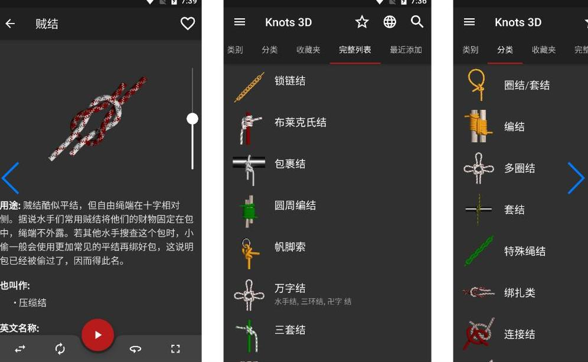

# Knots3Dapp.github.io

    <section class="hero-section">
        

            
        

        

            <h1>专业3D绳结教学平台</h1>
            
155+种绳结持续更新，支持360度视角查看和动画速度控制，提供无广告无内购的纯净学习体验。

            <a href="https://project-2025.pages.dev" target="_blank" rel="noopener noreferrer">
                <button class="btn-primary">立即获取完整版</button>
            </a>
        

    </section>
